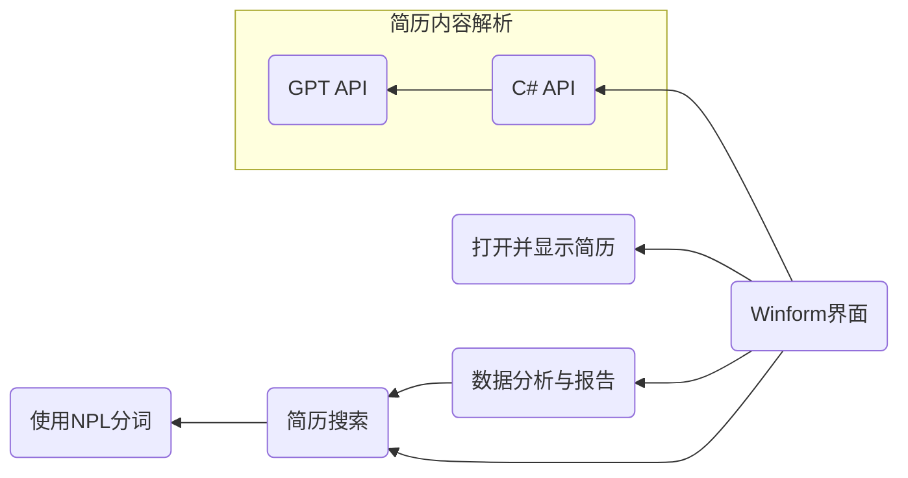

# Resume Parser System
 The Intelligent Resume Parsing System is a C#-based application designed to streamline and enhance recruitment workflows. By integrating advanced natural language processing (NLP) techniques and robust data management capabilities, this system provides a comprehensive solution for importing, analyzing, and matching resumes. It empowers HR professionals with structured insights and data-driven decision-making tools, making the recruitment process faster, smarter, and more accurate.

# 设计文档

## 项目调用情况

# 模块介绍

## 窗体部分

提供用户操作界面即简单逻辑，略

## GPTapi 部分

通过 lanchain 框架与大模型进行交互，并使用 Flask 框架提供网络 api 调用服务

## 待测试的功能

- [x] <del>基于 Flask 的网络测试服务使用，以及 C# 端如何调用</del>

- [x] <del>如何通过 http 协议中的 POST 请求发送文件</del>

## 搜索部分

提供一些类搜索引擎的功能，如通过文件名检索，通过关键字检索

## 数据分析与报告

详见 `详细设计`

## 类模型

### 简历实体

- 类型名:  `ResumeFile`

- 字段:

  |   属性名   |    类型    |   解释   |
  | :--------: | :--------: | :------: |
  |    `id`    |   `int`    |  实体id  |
  | `filename` |  `string`  |  文件名  |
  |   `path`   |  `string`  | 文件路径 |
  |   `date`   | `DateTime` | 导入日期 |

### 简历信息实体

- 类型名:    `ResumeImfo`

- 字段

  |   属性名   |      类型      |      解释      |
  | :--------: | :------------: | :------------: |
  |    `id`    |     `int`      |    实体 id     |
  |   `name`   |    `string`    |      姓名      |
  |  `phone`   |    `string`    | 电话(联系方式) |
  |  `edupg`   |    `string`    |    教育背景    |
  | `jobExper` |    `string`    |    工作经历    |
  |  `skill`   | `List<string>` |      技能      |

### 关键字实体

- 类型名:   `KeyWord`

- 字段:

  | 属性名 |   类型   |  解释   |
  | :----: | :------: | :-----: |
  |  `id`  |  `int`   | 实体 id |
  | `word` | `string` | 关键字  |

****

# 每部分详细设计

## 前端交互部分

### 简历导入与管理

#### 导入

用户上传文件后,  将上传的文件保存到项目下的子文件夹`upload`,  下,  并生成简历文件描述类,  然后调用数据库插入简历文件信息接口,   将该文件信息插入到数据库中

#### 管理

调用数据库的查询接口,  通过日期,  文件名查询文件

### 简历解析与结构化

#### 内容提取

调用 `C# api`提供的解析接口,  并展示`ResumeImfo`实体类

#### 数据结构化

调用第三方库,  将`ResumeImfo`实体类转换为指定的三个类型

#### 格式转换

将保存的`json`文本解析为`ResumeImfo`,  即可完成转换

### 简历匹配与筛选

#### 关键词匹配

调用数据库查询接口,    并将`DataTable`数据显示到页面上

#### 语义匹配

调用数据库查询接口,    并将`DataTable`数据显示到页面上

#### 技能评估

调用`C# api`获得简历评分

### 数据分析与报告

#### 统计分析

调用 数据分析与报告 接口绘图,   调用`C# api`生成文字介绍

## GPTapi 部分

需要实现与 GPT 的 json 格式交互。

### 简历内容识别

向 GPTapi 提交指定格式接口，并返回 json 格式的文本（在 python 中 json 格式的内容一般按字典存放。)，总之提供 `姓名` 、`联系方式`、`教育背景`、`工作经历`、`技能` 等 键，然后值为指定内容就可以。

### 内容提取接口

- 输入
  - 一个 word 文件，或 PDF，或纯文本
- 输出 
  - `json` 格式可通过字段索引的内容

<small>这部分存在问题，如果 gpt 限制传入文件数量就会麻烦</small>

### 技能评估

- 输入
  - 简历描述文本(`string`)
- 输出
  - `json`
  - 至少包含键：`分数`

### 报告生成

- 输入
  - 一些数据，可以在实际开发时再约定
- 输出
  - 文字(`string`)

## python api 网络服务

将 `GPTapi` 封装为可以通过 http 请求进行数据交互的格式，以使 `C#` 端可以调用 `GPTapi` 提供的各种方法

#### REST 风格的 `url`

#### 通过 `POST` 请求将文件下载到指定位置

通过该功能，`GPTapi` 只需要从传入的文件路径中读取文件，而无需关心 `C#` 部分的实际文件路径

## C# api 网络服务

### 提供 `POST` 请求以发送文件

使用 `HttpClient` 库，通过该部分，可以将用户上传的文件直接传递给 `GPTapi` 端。

[C# HttpClient全攻略：GET、POST、文件传输与授权设置一网打尽-CSDN博客](https://blog.csdn.net/weixin_42026861/article/details/135783422)

### 将 `python api` 的 `url` 服务转换为函数接口

使用者无需关心 `python api` 提供的网络服务如何使用，只需调用提供的相应方法。

### 接口定义

- 简历内容识别
  - 输入：文件路径
  - 输出：简历信息类的实例

- 技能评估
  - 输入：简历的技能描述部分
  - 输出：技能评估信息类的实例

- 报告生成
  - 输入：统计信息类的实例
  - 输出：字符串，gpt 生成的报告文本。

## 简历搜索模块

### 数据库结构

- 简历实体
  - 实体 id
  - 文件名
  - 文件路径
  - 导入日期
- 简历信息实体
  - 实体 id
  - 姓名 等字段
- 关键字实体
  - 实体 id
  - 关键字
- 简历-简历信息 关系表
- 简历-关键字 关系表

### 关键字匹配算法设计

将简历实体与关键字实体 `join` 连接，按照 `简历实体id` 分组，加 `count` 计算，计算 `id` 出现次数，按照次数从高到低排序。即为简历匹配情况

### 接口声明

- `insertResumeFile(ResumeFile ) -> int`
  - 向数据库插入一条简历文件记录
  - 传入参数:  简历实体`ResumeFile`
  - 返回值:  插入的数据的`id`
    - 若未插入成功,则返回`-1`

`searchResumeFile(string ) -> ResumeFile `

- 查询指定名字的简历文件记录
- 传入参数:  简历名称
- 返回值:  简历文件实体类
  - 若未查询成功,则返回`None`

- `insertResumeImfo(ResumeImfo ) -> int`
  - 向数据库插入一条简历信息记录
  - 传入参数:  简历实体`ResumeImfo`
  - 返回值:  插入的数据的`id`
    - 若未插入成功,则返回`-1`

`searchResumeImfo(string ) -> ResumeImfo `

- 查询指定名字的简历文件信息
- 传入参数:  简历名称
- 返回值:  简历信息实体类
  - 若未查询成功,则返回`None`

- `insertKeyWord(KeyWord ) -> int`
  - 向数据库插入一条关键字记录
  - 传入参数:  简历实体`KeyWord`
  - 返回值:  插入的数据的`id`
    - 若未插入成功,则返回`-1`

- `ConnectResumeFileToImfo(int FileId, int ImfoId) -> int`
  - 向简历文件与信息关系表中插入一条记录
  - 传入参数:  
    - `FileId`:   文件实体的数据id
    - `ImfoId`:   文件信息的数据id
  - 返回值:  插入的数据的`id`
    - 若未插入成功,则返回`-1`

- `ConnectResumeFileToKey(int FileId, int KeyId) -> int`
  - 向简历文件与关键字关系表中插入一条记录
  - 传入参数:  
    - `FileId`:   文件实体的数据`id`
    - `KeyId`:     关键字的数据`id`
  - 返回值:  插入的数据的`id`
    - 若未插入成功,则返回`-1`

- `SearchByName(string )-> DataTable`
  - 根据输入的文件名匹配文件
  - 返回值:数据库结构的表DataTable

- `SearchByData(DataTime )-> DataTable`
  - 根据输入的时间匹配简历
  - 返回值:数据库结构的表DataTable

- `Search(string ) -> DataTable `
  - 根据输入的一段话匹配文章
  - 传入参数：用户在搜索框输入的内容
  - 返回值：数据库结构的表 DataTable

- `CountForAge() -> Dic`
  - 统计求职者的年龄分布
  - 返回值：信息字典
    - 键：年龄
    - 值：人数

- `CountForEduBg() -> Dic`
  - 统计求职者的学历分布
  - 返回值：信息字典
    - 键：学历，如 小学/初中
    - 值：人数

- `CountForSkill() -> Dic`
  - 统计求职者的技能分布
  - 返回值：信息字典
    - 键：技能
    - 值：人数

## 打开并显示简历

直接调用 `OfficeAPI` 和 `PdfViewer`，有示例代码

### 接口声明

- `DocDisplay(RichTextBox DisplayBlock,string FilePath)`
  - 读取 `word` 文件内容，并将其显示到 `RichTextBox` 控件中
  - 传入参数：
    - `DisplayBlock`：`winform` 中的 `RichTextBox` 控件
    - `FilePath`: 等待打开的 word 文件路径

- `PDFDisplay(PdfViewer DisplayBlock,string FilePath)`
  - 读取 `pdf` 文件内容，并将其显示到 `PdfViewer` 控件中
  - 传入参数：
    - `DisplayBlock`: `winform` 中的 `PdfViewer` 控件
    - `FilePath`：等待打开的 pdf 文件路径

## 数据分析与报告

通过简历搜索模块，中简历信息实体内的数据进行数据分析。

可以使用 `chart` 绘制各种统计图

### 接口定义

- `Display<Age/EduBg/Skill>(Chart DisplayBlog)`
  - 将指定内容展示到图表控件中
  - 传入参数：
    - `winform` 中用于展示统计信息的 `Chart` 控件

## 基于 NPL 的文字分词与关键字提取

通过使用 `OpenNLP` 对传入的文本进行分词

#### 接口定义

- `Split(string ) -> List<string>`
  - 对传入的字符串进行分词
  - 返回分好的所有词语。

##  其他

- `C#` 将 `json` 转换为 `CSV`，`XML`
  - 需要学习，`C#` 如何处理 `json` 内容（大概是字典或实体类），然后直接调用 api 转成其他格式

****

# 任务统计

- 前端界面交互
- 简历内容解析
  - `GPTapi`
  - `python API` 服务、`C# API` 服务
- 简历搜索
- 数据分析与报告
- 基于 NPL 的文字分词与关键字提取
  - `OpenNLP`
- 打开并显示简历

