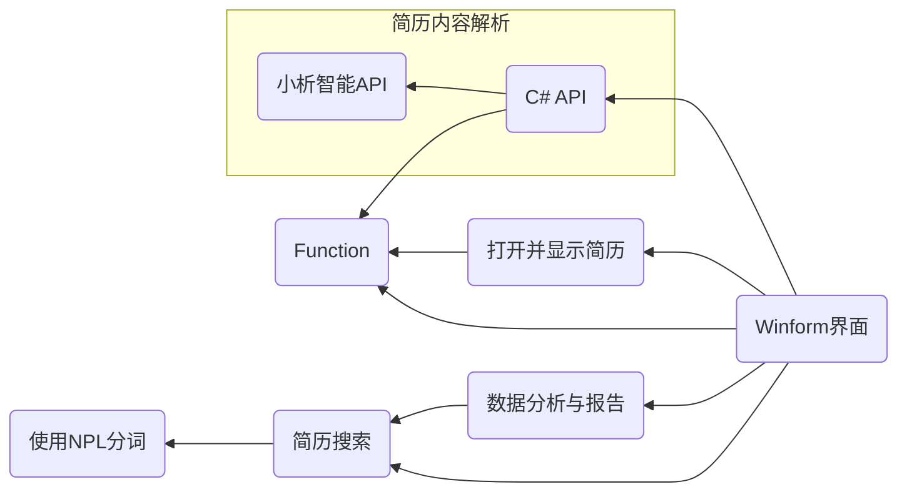

# Resume Parser System

 The Intelligent Resume Parsing System is a C#-based application designed to streamline and enhance recruitment workflows. By integrating advanced natural language processing (NLP) techniques and robust data management capabilities, this system provides a comprehensive solution for importing, analyzing, and matching resumes. It empowers HR professionals with structured insights and data-driven decision-making tools, making the recruitment process faster, smarter, and more accurate.

# 设计文档

---

## 项目调用情况

## 里程碑

- [ ] 前端页面
- [ ] C#API
- [x] Models
- [ ] 数据报告图像渲染
- [x] 文件打开与显示
- [ ] 数据库访问

## 模块介绍

### 功能清单

1. **简历导入与管理**
   1. $\checkmark$支持格式：系统应支持常见的简历格式，包括但不限于Word（.doc, .docx）、PDF和纯文本（.txt）
   2. $\checkmark$导入方式：允许用户通过拖拽、点击上传等方式单个或批量提交简历。
   3. 存储与检索：可按导入日期，文件名称等方式查询简历。可根据用户的选择，打开并显示一份简历文件。

2. **简历解析与结构化**
   1. 内容提取：自动从简历中提取求职者信息，如姓名、联系方式、教育背景、工作经历、技能等。
   2. 数据结构化：为用户提供多种简历解析数据的格式，包括但不限于JSON、CSV、XML。
   3. 格式转换：支持将解析后的一种简历数据格式转换为其他格式。

3. **简历匹配与筛选**
   1. 关键词匹配：允许用户设定关键词，系统根据关键词自动筛选符合条件的简历。
   2. 语义匹配：利用NLP技术，实现简历与职位描述之间的语义匹配，提高筛选的准确性。
   3. 技能评估：根据求职者简历中的技能描述，评估其技能熟练度，并给出相应的评分。

4. **数据分析与报告**
   1. 统计分析：对简历数据进行统计分析，如求职者年龄分布、学历分布、技能分布等。
   2. 报告生成：提供可视化报告，以图表形式展示分析结果，并配以文字介绍。

### 窗体部分

提供用户操作界面即简单逻辑，略

> 弃用的功能
>
> ### GPTapi 部分
>
> 通过 lanchain 框架与大模型进行交互，并使用 Flask 框架提供网络 api 调用服务

### 搜索部分

提供一些类搜索引擎的功能，如通过文件名检索，通过关键字检索

### 数据分析与报告

详见 `详细设计`

### 类模型

#### 简历实体

- 类型名:  `ResumeFile`

- 字段:
  
  |    属性名    |    类型    |        解释        |
  | :----------: | :--------: | :----------------: |
  |     `id`     |   `int`    |       实体id       |
  |  `filename`  |  `string`  |       文件名       |
  | `Base64Data` |  `string`  | 文件Base64编码内容 |
  |    `date`    | `DateTime` |      导入日期      |

#### 简历信息实体

- 类型名: `ResumeImfo`
- 字段:
  - `BaseImfo`
  - `EduBG`
  - `WorkExper`

#### 关键字实体

- 类型名:   `KeyWord`

- 字段:
  
  | 属性名    | 类型       | 解释    |
  |:------:|:--------:|:-----:|
  | `id`   | `int`    | 实体 id |
  | `word` | `string` | 关键字   |

****

## 每部分详细设计

### 前端交互部分

#### 简历导入与管理

##### 导入

用户上传文件后,  将上传的文件保存到项目下的子文件夹`upload`,  下,  并生成简历文件描述类,  然后调用数据库插入简历文件信息接口,   将该文件信息插入到数据库中

##### 管理

调用数据库的查询接口,  通过日期,  文件名查询文件

#### 简历解析与结构化

##### 内容提取

调用 `C# api`提供的解析接口,  并展示`ResumeImfo`实体类

##### 数据结构化

调用第三方库,  将`ResumeImfo`实体类转换为指定的三个类型

##### 格式转换

将保存的`json`文本解析为`ResumeImfo`,  即可完成转换

#### 简历匹配与筛选

##### 关键词匹配

调用数据库查询接口,    并将`DataTable`数据显示到页面上

##### 语义匹配

调用数据库查询接口,    并将`DataTable`数据显示到页面上

##### 技能评估

调用`C# api`获得简历评分

#### 数据分析与报告

##### 统计分析

调用 数据分析与报告 接口绘图,   调用`C# api`生成文字介绍

### C# api 网络服务

通过调用小析智能API,   解析文件内容,    提供一个简历解析类以进行简历解析

#### 类定义

##### `LinkToAPI(string user, string token)`

- 构造函数
  - 输入:  小析智能API,   的用户名与Token

> ##### 对pdf文件进行Base64编码
>
> [C#中pdf文件与base64字符串的相互转换_c# pdf转base64-CSDN博客](https://blog.csdn.net/qq_41760419/article/details/139118479)

##### `GetResumeImfo(ResumeFile ) ->  ResumeImfo`

- 简历内容识别
  
  - 输入：
    - `ResumeFile`类型的对象
  - 输出：简历信息类的实例

##### `GetSkillGrade(ResumeFile ) -> Dic`

- 技能评估

  - 输入：
    - `ResumeFile`类型的对象

  - 输出：字典
    - 键为技能
    - 值为分数

### Function部分

该部分提供各层所需要的基础服务

其中,    已经包含的基础服务如下

#### 包含的基础服务

##### `Base64Helper`

- `Base64`编码支持

  - 将文件以`Base64`编码

  - 将文件以`Base64`解码

##### `Factory`

- 对象工厂
  - `ResumeFileFactory`简历文件对象工厂,支持将指定路径下的文件生成为简历文件对象
  - `ResumeImfoFactory`简历信息对象工厂,支持将指定格式`Json`格式字符转换为简历信息对象.

##### 基于 NPL 的文字分词与关键字提取

通过使用 `OpenNLP` 对传入的文本进行分词

- `Split(string ) -> string[]`
  - 对传入的字符串进行分词
  - 返回分好的所有词语。

### 简历搜索模块

#### 数据库结构

- **简历实体**
  - 实体 id
  - 文件名
  - 文件Base64编码字符串
  - 导入日期
- **简历信息实体**
- **技能信息实体**
  - id
  - 技能(string)

- **关键字实体**
  - 实体 id
  - 关键字
- **简历-关键字 关系表**
- **简历-简历信息关系表**
- **简历信息-技能关系表**

#### 关键字匹配算法设计

将简历实体与关键字实体 `join` 连接，按照 `简历实体id` 分组，加 `count` 计算，计算 `id` 出现次数，按照次数从高到低排序。即为简历匹配情况

> #### 关于查询操作传入的参数规范
>
> 类型`Dic<string,List<string>>`
>
> 其中键为对应数据表的字段
>
> 值为所有待匹配的可能的内容
>
> 详见[`DataBaseControl`功能介绍](./DataBaseControl.md) 中的**使用示例**

#### 基类`DataBaseControl`功能介绍

见[`DataBaseControl`功能介绍](./DataBaseControl.md)

#### 接口声明

> 增删改查操作接口定义见[操作接口定义](./IDataControl.md)

##### `CountForAge() -> Dic`

- 统计求职者的年龄分布
- 返回值：信息字典
  - 键：年龄
  - 值：人数

##### `CountForEduBg() -> Dic`

- 统计求职者的学历分布
- 返回值：信息字典
  - 键：学历，如 小学/初中
  - 值：人数

##### `CountForSkill() -> Dic`

- 统计求职者的技能分布
- 返回值：信息字典
  - 键：技能
  - 值：人数

### 打开并显示简历

直接调用 `OfficeAPI` 和 `PdfViewer`，有示例代码

#### 详细设计

该部分以用户控件库的模式实现

##### 简历显示控件`FileRender`

简历显示控件提供两种构造函数:  

- `FileRender(sting )`
  - 传入参数:
    - 文件路径`string`

- `FileRender(ResumeFile )`
  - 传入参数:
    - 文件对象`ResumeFile`

### 数据分析与报告

通过简历搜索模块，中简历信息实体内的数据进行数据分析。

可以使用 `chart` 绘制各种统计图,    以用户控件库的模式实现

#### 控件统计

##### `Display<Age/EduBg/Skill>`

- 将指定内容展示到图表控件中

其中,    图标展示的数据直接通过调用简历信息查询模块提供的数据统计功能.

#### 报告生成

报告生成函数放在`Function`类库中

### 其他

- `C#` 将 `json` 转换为 `CSV`，`XML`
  - 需要学习，`C#` 如何处理 `json` 内容（大概是字典或实体类），然后直接调用 api 转成其他格式

---

## 贡献者

[03xiaoyuhe (听)](https://github.com/03xiaoyuhe)

[Running-Turtle1 (running_Turtle)](https://github.com/Running-Turtle1)

[M-Pine](https://github.com/M-Pine)

[cola-cold (核子可乐)](https://github.com/cola-cold)

## 特别鸣谢

感谢[API开发文档 - 小析智能](https://wiki.xiaoxizn.com/#parser)提供的 $200$ 次简历解析试用。
